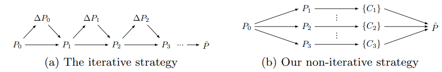
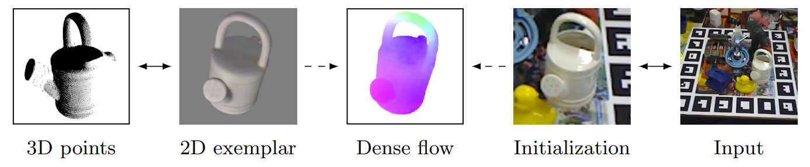

# Overview

This repository contains the code for the paper [**Perspective Flow Aggregation for Data-Limited 6D Object Pose Estimation**](https://arxiv.org/abs/2203.09836). Yinlin Hu, Pascal Fua, and Mathieu Salzmann. ECCV 2022.

<p align="center">
  
  <br>
  <em>Different pose refinement paradigms. (a) Given an initial pose P0, existing refinement strategies estimate a pose difference ∆P0 from the input image and the image rendered according to P0, generating a new intermediate pose P1. They then iterate this process until it converges to the final pose Pˆ. This strategy relies on estimating a delta pose from the input images by extracting global object features. These features contain high-level information, and we observed them not to generalize well across domains. (b) By contrast, our strategy queries a set of discrete poses {P1, P2, P3, . . . } that are near the initial pose P0 from pre-rendered exemplars, and computes the final pose Pˆ in one shot by combining all the correspondences {Ci} established between the exemplars and the input. Estimating dense 2D-to-2D local correspondences forces the supervision of our training to occur at the pixel-level, not at the image-level as in (a). This makes our DNN learn to extract features that contain lower-level information and thus generalize across domains. In principle, our method can easily be extended into an iterative strategy, using the refined pose as a new initial one. However, we found a single iteration to already be sufficiently accurate.</em>
</p>

<p align="center">
  
  <br>
  <em>From Optical Flow to Pose Refinement. After obtaining an exemplar based on the initial pose, we estimate dense 2D-to-2D correspondences between the exemplar and the input image within their respective region of interest. This implicitly generates a set of 3D-to-2D correspondences, which can be used to obtain the final pose by PnP solvers.</em>
</p>

# How to Use

* Download [LINEMOD data](https://u.pcloud.link/publink/show?code=XZeRguVZTFv4x0yBf5fva1ALHiTC9Y1CzWey), [pose initializations](https://u.pcloud.link/publink/show?code=XZfRguVZMzhhbnvKm6QkvcFyIsdwlhrl352y), and [pretrained model](https://u.pcloud.link/publink/show?code=XZDRguVZHYfOMIyuH6ma8cFjFCi2dh0yBRDy).

* Extract LINEMOD into "data" in the current directory.

* Run PFA by `python refinement.py` or `bash refinement.sh`.

* Typically, the output will be like:

```
Loading initial poses from "./wdr_init.json" ...

Before PFA refinement:
        ADI.05d ADI.10d ADI.20d ADI.50d AUC     REP02px REP05px REP10px REP20px 
cls_00  18.27   42.72   74.50   98.67   84.87   60.42   98.10   99.81   100.00
cls_01  44.77   76.55   97.29   99.90   82.02   24.61   94.57   99.71   99.90
cls_02  29.38   58.28   84.43   99.51   80.34   32.42   95.49   100.00  100.00
cls_03  48.18   80.83   97.74   99.90   86.39   33.82   94.00   99.80   99.90
cls_04  27.15   54.69   85.73   99.70   82.41   56.99   98.70   100.00  100.00
cls_05  36.24   68.61   93.96   99.90   77.53   10.00   77.62   98.61   99.80
cls_06  14.45   32.65   57.22   92.78   76.16   51.78   97.84   99.62   99.72
cls_07  26.10   73.52   96.90   99.81   86.40   7.79    44.23   96.34   99.91
cls_08  54.00   88.04   99.04   99.71   89.66   13.40   71.84   98.07   100.00
cls_09  12.56   30.35   64.51   96.96   74.09   50.14   97.05   99.05   99.24
cls_10  37.08   73.95   97.34   99.90   78.51   12.36   81.92   99.80   99.90
cls_11  16.30   47.65   87.34   100.00  66.76   5.66    70.37   97.70   99.90
cls_12  32.92   65.28   87.89   98.20   78.60   19.21   82.97   96.50   98.68

Loading flow model from "./linemod.pth" ...

After PFA refinement:
        ADI.05d ADI.10d ADI.20d ADI.50d AUC     REP02px REP05px REP10px REP20px 
cls_00  48.62   78.69   96.96   100.00  93.04   96.19   98.67   100.00  100.00
cls_01  88.37   98.64   99.81   99.90   93.55   89.73   99.71   99.90   99.90
cls_02  80.80   97.06   99.71   100.00  94.22   91.09   99.12   100.00  100.00
cls_03  82.99   97.64   99.80   99.90   93.61   91.74   99.41   99.90   99.90
cls_04  66.87   93.21   99.60   100.00  93.36   95.71   99.30   100.00  100.00
cls_05  85.15   98.12   99.50   99.90   92.12   81.39   98.61   99.70   99.80
cls_06  52.72   82.18   96.81   99.34   92.64   92.59   98.87   99.72   99.72
cls_07  95.68   99.81   99.91   99.91   96.28   80.28   99.25   99.91   100.00
cls_08  89.10   99.71   100.00  100.00  94.85   51.21   97.01   100.00  100.00
cls_09  66.51   89.82   98.19   99.05   92.39   94.10   98.67   99.24   99.24
cls_10  92.44   99.39   99.90   99.90   93.55   89.68   98.77   99.90   99.90
cls_11  92.04   99.04   100.00  100.00  93.15   86.48   98.56   99.90   100.00
cls_12  74.27   91.77   97.63   98.77   90.22   87.42   98.01   98.77   98.96
```

# Citing

```
@inproceedings{hu2022pfa,
  title={Perspective Flow Aggregation for Data-Limited 6D Object Pose Estimation},
  author={Yinlin Hu and Pascal Fua and Mathieu Salzmann},
  booktitle={ECCV},
  year={2022}
}
```

# Notes

* The pose initializations come from [WDR-Pose](https://github.com/cvlab-epfl/wide-depth-range-pose).
* We use online rendering (Pytorch3d) in this repo, which is the version used in the best single-model method in [BOP challenge 2022](https://bop.felk.cvut.cz/home/).
